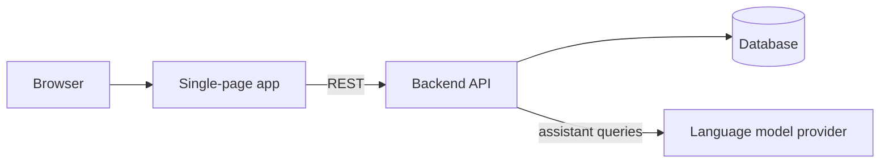

[English](README.md) · [Русский](README.ru.md)

# Corporate Website with Admin Panel

A single-page corporate website for a technology company, paired with a private panel for managing content and incoming requests.

## Purpose

The site presents a technology company and the services it offers, collects enquiries from prospective clients, and publishes news. Visitors move through a single scrolling page — company profile, service lines, figures, mission, contact form — with an AI assistant available at any point to answer questions. Staff work in a separate password-protected area where news is written and published and incoming enquiries are triaged, with no developer involvement. The front end is a static bundle; all content and correspondence live behind a REST API on a separate backend service.

## Who it is for

Two distinct circuits share one codebase:

- **Public** — visitors and prospective clients. Everything on the marketing site, open to anyone.
- **Administrative** — company staff. Reachable only under `/admin`, behind a login and a bearer token; rendered without the site header, chat widget, or 3D background.

## Features

**Public side**

- Company profile, mission, and key figures presented as one continuous page
- Service catalogue with six practice areas and short descriptions
- Service request form with client-side validation, submitted to the backend
- News feed loaded from the API, shown in a carousel with a local fallback when the backend is unreachable
- AI assistant in a floating chat widget — the backend answers from a curated knowledge base and falls back to a language model
- Separate channels inside the widget for urgent support requests and site feedback with a rating
- Animated 3D background: a particle field that assembles into a geographic outline and domain glyphs, with colour and bloom shifting as the visitor scrolls
- Language selector (KZ / RU / EN) in the header — currently a UI control only; content is Russian

**Administrative side**

- Login screen; the issued token is stored in the browser and attached to every protected call
- Requests view with status changes and a live counter of unhandled items
- Enquiries and site feedback in a shared view
- Full news management: create, edit, delete, publish
- An expired or rejected token logs the session out and returns to the login screen automatically

## Architecture

The client is a static single-page application served from a CDN; every route falls through to the app shell, and navigation happens without page reloads. All data — news, requests, feedback, assistant replies — is fetched from a REST API over JSON. Administrative calls carry a bearer token and are rejected without one; the language-model credentials stay on the server and never reach the browser.

## Stack

| Layer | Technology |
| --- | --- |
| Frontend | React 19 |
| Build | Vite 8 |
| Styling | Tailwind CSS 3 with a custom brand theme |
| Routing | React Router 7 (client-side, nested admin routes) |
| 3D graphics | Three.js with SVG loading and bloom post-processing |
| Icons | Lucide |
| Internationalisation | Not yet wired up — the header selector is a placeholder |
| Offline / PWA | Not implemented |
| AI integration | Server-side: knowledge base plus a hosted language model |
| Backend | Separate REST service, token-authenticated |
| Storage | Managed database behind the API |
| Hosting | Vercel (frontend) with SPA rewrites; the API runs as its own service |

## Status

In active development: the public site and the admin panel both run against a live API, while localisation and offline support remain open.
