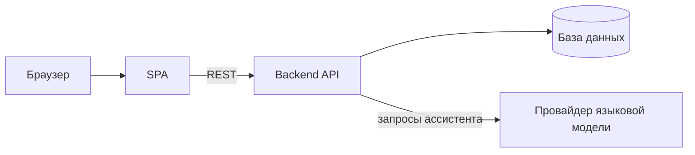

[English](README.md) · [Русский](README.ru.md)

# Корпоративный сайт с административной панелью

Одностраничный сайт технологической компании и закрытая панель для управления контентом и поступающими заявками.

## Назначение

Сайт представляет технологическую компанию и её услуги, принимает заявки от потенциальных клиентов и публикует новости. Посетитель проходит одну прокручиваемую страницу — описание компании, направления деятельности, показатели, миссия, форма обращения, — и в любой момент может задать вопрос ИИ-ассистенту. Сотрудники работают в отдельном закрытом разделе: пишут и публикуют новости, разбирают поступившие заявки — без участия разработчика. Клиентская часть остаётся статической сборкой, весь контент и переписка хранятся за REST API на отдельном backend-сервисе.

## Для кого

В одной кодовой базе живут два контура:

- **Публичный** — посетители и клиенты. Всё содержимое сайта, доступ без ограничений.
- **Административный** — сотрудники компании. Только по адресу `/admin`, после входа по логину и токену; отрисовывается без шапки сайта, чат-виджета и 3D-фона.

## Возможности

**Публичная часть**

- Презентация компании, миссии и ключевых показателей одной непрерывной страницей
- Каталог из шести направлений деятельности с краткими описаниями
- Форма заявки на услугу с проверкой полей и отправкой на backend
- Лента новостей из API в карусели; при недоступности сервиса подставляются локальные данные, страница не ломается
- ИИ-ассистент в плавающем чат-виджете: backend отвечает из подготовленной базы знаний, при её промахе — через языковую модель
- Внутри виджета — отдельные каналы для срочного обращения в поддержку и для отзыва о сайте с оценкой
- Анимированный 3D-фон: облако частиц собирается в географический контур и отраслевые глифы, цвет и свечение меняются по мере прокрутки
- Переключатель языков (KZ / RU / EN) в шапке — пока только элемент интерфейса, контент русскоязычный

**Административная часть**

- Экран входа; выданный токен сохраняется в браузере и подставляется во все защищённые запросы
- Раздел заявок: смена статуса, счётчик необработанных обращений обновляется автоматически
- Обращения в поддержку и отзывы о сайте в общем разделе
- Полное управление новостями: создание, редактирование, удаление, публикация
- Истёкший или отклонённый токен завершает сессию и возвращает на экран входа

## Архитектура

Клиент — статическое одностраничное приложение, любой маршрут отдаётся одной точкой входа, переходы происходят без перезагрузки. Данные (новости, заявки, отзывы, ответы ассистента) приходят с REST API в JSON. Административные операции защищены токенной авторизацией: без заголовка с токеном запрос отклоняется, а ключ языковой модели остаётся на сервере и на клиент не попадает.

## Стек

| Слой | Технология |
| --- | --- |
| Frontend | React 19 |
| Сборка | Vite 8 |
| Стилизация | Tailwind CSS 3, собственная тема бренда |
| Маршрутизация | React Router 7, клиентские маршруты + вложенные админские |
| 3D-графика | Three.js, загрузка SVG, постобработка bloom |
| Иконки | Lucide |
| Интернационализация | Не подключена — переключатель в шапке пока декоративный |
| Офлайн / PWA | Не реализовано |
| ИИ-интеграция | На стороне сервера: база знаний + размещённая языковая модель |
| Backend | Отдельный REST-сервис с токенной авторизацией |
| Хранилище | Управляемая база данных за API |
| Хостинг | Vercel (frontend) с SPA-переадресацией; API развёрнут отдельным сервисом |

## Статус

Активная разработка: публичная часть и админ-панель работают с живым API, локализация и офлайн-режим ещё впереди.
